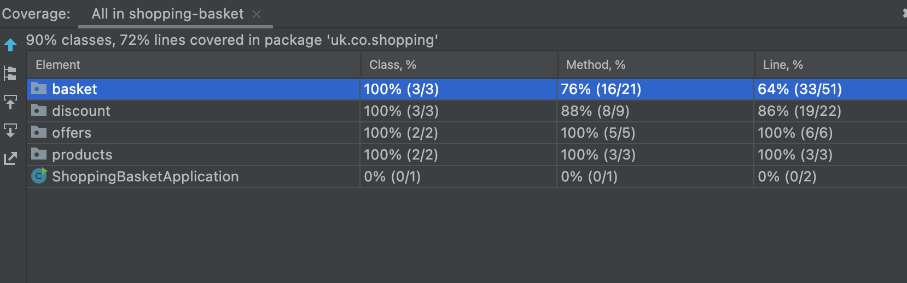

# shopping-basket

## Objective:

Write a program which will calculate the total price of a basket of shopping, taking into account the special offers. 
There is no need to write a parser: use a list of strings, or some other simple type as the input for your application.

#Shopping Basket

Apple, Apple, Orange, Apple, Pineapple, Banana, Orange, Banana

#Pricing the Basket

Price List
£
Item      Price Per Item

Apple      12p
Orange     32p
Banana     51p
Pineapple  95p

Special Offers

Apples are buy one get one free
Bananas are three for two

#Test Coverage

